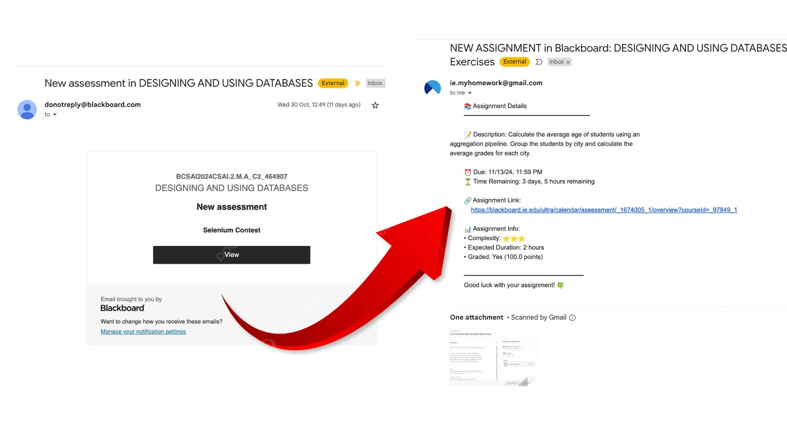

<p align="center"> WATCH DEMO VIDEO:
  <a href="https://www.youtube.com/watch?v=70l_UOMbAj4">
    
  </a>
</p>

# Blackboard Assignment Scraper

An automated tool that scrapes assignment information from Blackboard's learning management system, helping students stay organized with their coursework through automated tracking, notifications, and AI-powered summaries.

<p align="center">
  
</p>

## Features

### 🔐 Automated Login & Session Management
- Handles Microsoft authentication flow with MFA support
- Smart cookie management for persistent sessions
- Graceful handling of login failures and timeouts

### 📚 Assignment Data Collection
Automatically collects comprehensive assignment details:
- Course names and assignment titles
- Due dates and times
- Assignment types and categories
- Grading information (maximum points)
- Direct assignment URLs
- Page screenshots for reference

### 💾 Data Management
- CSV-based data storage
- Duplicate entry prevention
- Organized directory structure for:
  ```
  utils/
  ├── ai_summaries/    # AI-generated assignment summaries
  ├── screenshots/     # Assignment page captures
  ├── logger/         # Operation logs
  ├── cookies/        # Session cookies
  ├── csv/           # Assignment data
  └── OAuth/         # Email authentication
  ```

### 🔔 Smart Features
- Email notifications for new assignments (daily, weekly and new posts)
- AI-powered assignment summarization
- Comprehensive logging system
- Environment variable support for credentials

## Prerequisites

- Python 3.x
- Chrome WebDriver
- Required Python packages:
  ```
  selenium
  pandas
  pickle
  pathlib
  ```

## Setup

1. Clone the repository:
   ```bash
   git clone https://github.com/javidsegura/blackboard-scraper.git
   ```

2. Install dependencies:
   ```bash
   pip install -r utils/docs/requirements.txt
   ```

3. Configure environment variables:
   ```bash
   export BLACKBOARD_USERNAME='your_username'
   export BLACKBOARD_PASSWORD='your_password'
   ```

## Usage

Run the scraper:
```bash
python src/main.py
```

